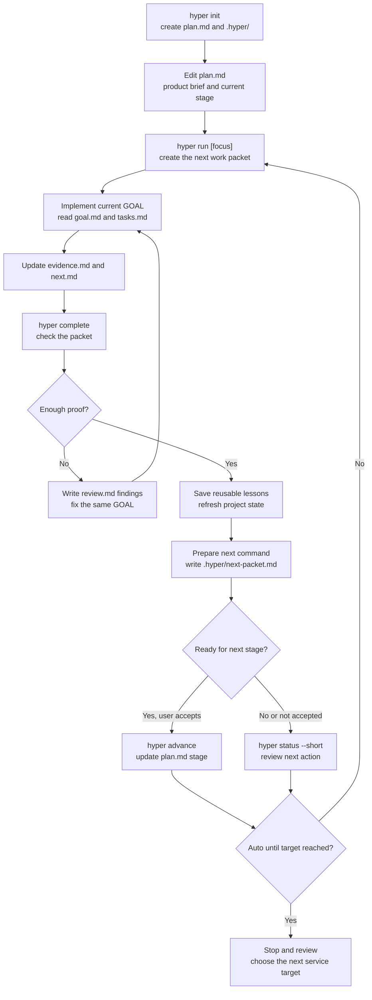

<p align="right">
  <a href="./README.md"><kbd>English</kbd></a>
  <a href="./README_ko.md"><kbd>한국어</kbd></a>
</p>

# Hyper Run

Hyper Run helps AI coding sessions keep project memory between runs.

You keep a short `plan.md` in your project. `hyper run` turns that plan and the project history into the next focused work packet. After the work is done, `hyper complete` reads the evidence and prepares the next step.

The goal is simple: start from a small MVP and keep improving it without every AI session feeling like a reset.

The basic command is:

```bash
hyper run
```

Hyper Run works with Codex Desktop, CLI agents, Cursor-style agents, and other coding assistants because the work packet is just files inside the project.

## Why Use It

AI coding sessions often lose project context:

- the next task becomes too broad
- previous decisions are forgotten
- test or browser proof is scattered across chat
- a small MVP does not naturally grow into a reliable service

Hyper Run keeps that context in your repo.

It is not a project manager. It is not a big framework. It is a small CLI that creates the next focused AI work packet, asks for proof, and uses that proof to make the next packet better.

## The Loop

```text
plan.md -> hyper run -> goal.md/tasks.md -> evidence.md/next.md -> hyper complete -> next packet
```

What you actually touch:

| File or command | What it means |
| --- | --- |
| `plan.md` | A plain product brief: what you are building, who it is for, current stage, and constraints. |
| `hyper run` | Creates the next focused work packet. |
| `goal.md` / `tasks.md` | What the AI should do now. |
| `evidence.md` | What changed and how it was checked. |
| `next.md` | The one next recommended step and reusable lessons. |
| `hyper complete` | Closes the packet, checks the evidence, and prepares the next step. |
| `hyper status --short` | Shows the current stage, blocker, and next action. |

## How It Grows

Hyper Run does not ask you to build a harness on day one.

It starts light: one plan, one focused packet, one evidence file. If the same need keeps appearing, Hyper Run can suggest project-specific structure later, such as a validator, skill, agent, or harness.

For example:

- if every packet needs `npm run build`, Hyper Run may suggest a validator
- if every UI change needs a browser screenshot, it may suggest a visual check
- if the project repeatedly hits the same failure mode, it may turn that into a stop condition

Those suggestions are not forced immediately. They stay as candidates until repeated evidence proves they are useful.

## Terms You May See

Hyper Run has internal terms, but you do not need to memorize them.

| Term | Plain meaning |
| --- | --- |
| Runtime packet | The next AI work bundle. |
| Evidence | Proof that the work was done and checked. |
| Proof Contract | The packet's proof checklist. |
| Learn | Extracting reusable lessons from `evidence.md` and `next.md`. Not a summary. |
| Pressure Ledger | A list of repeated needs, gaps, or failures the project keeps showing. |
| Readiness pressure | The next missing proof needed to move the project forward. |
| Capability candidate | A suggested validator, skill, agent, or harness. It is not active yet. |
| Growth without a harness | Start light; add structure only after the project proves it needs it. |

The short version:

- no structure before repeated need
- no stage advancement without evidence
- no memory unless it changes future work

## Stages

Stages tell the AI what kind of proof matters right now.

| Stage | What Hyper Run tries to prove |
| --- | --- |
| Tiny MVP | One useful thing works. |
| Usable MVP | The main flow is usable end-to-end. |
| Beta | Realistic data, errors, validation, docs, and release path are repeatable. |
| Service Quality | Security, deployment, operations, rollback, repeatable checks, and category benchmark are good enough to treat it like a real service. |

For Service Quality benchmark examples, see [Reference Benchmark Evidence Examples](docs/examples/reference-benchmark.md).

`hyper run` keeps generating the next focused packet until the project reaches the stage you are aiming for.

## Basic Flow

```bash
hyper init
# edit plan.md once

hyper run "Build the smallest usable MVP"
# implement the generated packet
# update evidence.md and next.md

hyper complete
hyper status --short
hyper advance   # only when the stage gate is ready and you accept the stage change
hyper doctor
hyper run "Next improvement"
```

## Execution Flow



`hyper complete` checks the packet before saving lessons. If validation, stage evidence, active checks, or `next.md` is not good enough yet, it writes findings to the current packet's `review.md` and keeps you in the same packet.

For longer Codex Desktop sessions, start with an auto target:

```bash
hyper run --auto --until service-quality "Keep upgrading this service"
```

Auto mode does not skip proof or silently advance stages. It keeps the next packet command planned in `.hyper/next-packet.md`; stage changes still require explicit acceptance with `hyper advance`.

In Codex Desktop you can use the same idea as a project command:

```text
$hyper init
$hyper run
```

`$hyper run` means Codex should run the native `hyper` CLI, read the generated `.hyper/goals/.../goal.md`, implement it, update evidence, and prepare the next recommendation.

## Install

### macOS / Linux

Install the latest native binary:

```bash
curl -fsSL https://raw.githubusercontent.com/KoreanCode/orange-hyper-run/main/install.sh | sh
```

For GitHub release installs, the installer downloads `checksums.txt` and verifies the binary with SHA256 before moving it into place.

Release assets also include cosign keyless signature bundles. If `cosign` is installed, the installer verifies the signature after checksum verification. To make signature verification mandatory, set `HYPER_RUN_VERIFY_SIGNATURE=required`.

Check it:

```bash
hyper version
```

Manual macOS install:

Apple Silicon:

```bash
mkdir -p ~/.local/bin
curl -fsSL https://github.com/KoreanCode/orange-hyper-run/releases/latest/download/hyper-darwin-arm64 -o ~/.local/bin/hyper
chmod +x ~/.local/bin/hyper
hyper version
```

Intel Mac:

```bash
mkdir -p ~/.local/bin
curl -fsSL https://github.com/KoreanCode/orange-hyper-run/releases/latest/download/hyper-darwin-amd64 -o ~/.local/bin/hyper
chmod +x ~/.local/bin/hyper
hyper version
```

### Windows

Install the latest Windows x64 binary with PowerShell:

```powershell
powershell -NoProfile -ExecutionPolicy Bypass -Command "irm https://raw.githubusercontent.com/KoreanCode/orange-hyper-run/main/install.ps1 | iex"
```

The PowerShell installer downloads `checksums.txt` and verifies the binary with SHA256 before moving it into place.

Release assets also include cosign keyless signature bundles. If `cosign` is installed, the installer verifies the signature after checksum verification. To make signature verification mandatory, set `$env:HYPER_RUN_VERIFY_SIGNATURE="required"`.

If the installer warns that `~\.local\bin` is not on `PATH`, add it:

```powershell
[Environment]::SetEnvironmentVariable("Path", $env:Path + ";$env:USERPROFILE\.local\bin", "User")
```

Open a new terminal, then check:

```powershell
hyper version
```

Other release binaries:

- `hyper-darwin-amd64` for Intel macOS
- `hyper-linux-amd64` for Linux x64
- `hyper-linux-arm64` for Linux ARM64
- `hyper-windows-amd64.exe` for Windows x64

Make sure `~/.local/bin` is on your `PATH`.

## Install From Source

```bash
go install github.com/KoreanCode/orange-hyper-run/cmd/hyper@latest
```

## Update

```bash
hyper update
```

This downloads the latest GitHub release. If Hyper Run cannot replace the current executable, it installs to `~/.local/bin/hyper`.
For GitHub release updates, Hyper Run downloads `checksums.txt` and verifies the binary before replacing the executable.

To update from a fork:

```bash
hyper update github:OWNER/orange-hyper-run
```

## Project Setup

Run this once inside your project:

```bash
hyper init
```

It creates:

- `plan.md`
- `.hyper/`
- Codex Desktop routing files such as `AGENTS.md` and `.agents/skills/...`

Then fill in `plan.md` in plain language:

```markdown
# Product Plan

## Product

What are we building?

## Target Users

Who is it for?

## MVP

What is the smallest useful version?

## Current Stage

Tiny MVP

## Build Style

Web app

## Non-goals

What should not be built yet?

## Constraints

Technical or product constraints.

## Success Criteria

How do we know this stage is done?

## Current Focus

What should the next run improve?
```

If `plan.md` is sparse, Hyper Run may create `.hyper/plan-candidates.md` from README or docs so you can copy useful product context into `plan.md`.

## What `hyper run` Does

`hyper run` creates a new runtime packet:

```text
.hyper/goals/GOAL-0001/
  goal.md
  tasks.md
  evidence.md
  review.md
  next.md
```

The important files are:

- `goal.md`: what to build now
- `tasks.md`: checkpoints for this run
- `evidence.md`: proof of what changed and what was validated
- `next.md`: what should happen next

Hyper Run blocks a new `hyper run` if the previous packet still has pending evidence. Finish the current packet with `hyper complete` first.

## What `hyper complete` Does

After implementation, update `evidence.md` and `next.md`, then run:

```bash
hyper complete
```

This closes the current packet and updates project memory:

- decisions to keep
- reusable patterns
- failures or blockers
- constraints
- readiness progress

`hyper complete` also prints the next recommended action. If the gate is ready, it will tell you to run `hyper advance`. Otherwise it will point to the next smallest `hyper run` focus. The next `hyper run` uses the learned information to change the work boundary, validation signals, stop conditions, readiness pressure, and capability candidates.

## Readiness In Simple Terms

Hyper Run tries to grow the project stage by stage:

```text
Tiny MVP -> Usable MVP -> Beta -> Service Quality
```

It checks whether the project has evidence for things like:

- product clarity
- core UX
- persistence
- error handling
- validation
- security
- deployment
- docs
- maintainability

You record this in `evidence.md`:

```text
## Readiness Evidence

Core UX: Browser smoke test passed for create and complete flow.
Validation coverage: `go test ./...` passed and is repeatable.
Data persistence: Records survive reload using SQLite.
```

When enough evidence exists, `hyper status` shows the next stage is ready. Hyper Run still does not change the stage silently. If you accept the recommendation, run:

```bash
hyper advance
```

That updates `plan.md` from the current stage to the next stage, refreshes readiness, and then the next `hyper run` starts using the new stage behavior.

## Commands

```bash
hyper init                  # install Hyper Run files in this project
hyper run [focus]           # create the next runtime packet
hyper run --auto --until service-quality [focus]
hyper complete              # run the finish gate, close the packet, and learn
hyper advance               # apply an accepted stage change when the gate is ready
hyper status                # show current stage, gaps, and readiness
hyper status --short        # show only stage, gate, proof, and next action
hyper doctor                # diagnose install, PATH, project state, and Codex routing
hyper repair                # reconcile state.json when packet evidence and state disagree
hyper migrate               # refresh growth/readiness state after Hyper Run upgrades
hyper resume                # print the current handoff again
hyper update                # update the native binary
hyper version               # show version and binary path
hyper internal learn        # debug/manual learning command
```

## Local Development

From this repository:

```bash
go test ./...
go vet ./...
go build -o dist/hyper ./cmd/hyper
```

Then test it in another project:

```bash
cd ../my-project
../orange-hyper-run/dist/hyper init
../orange-hyper-run/dist/hyper run "Build the smallest usable MVP"
../orange-hyper-run/dist/hyper complete
```

## More Detail

- [Service Definition](docs/SERVICE_DEFINITION.md)
- [Architecture](docs/ARCHITECTURE.md)
- [Tiny MVP Flow Example](examples/tiny-mvp-flow/README.md)
- [Before / After Demo](examples/before-after-demo/README.md)
- [Roadmap](docs/ROADMAP.md)
- [Changelog](docs/CHANGELOG.md)
- [Known Limitations](docs/KNOWN_LIMITATIONS.md)

## License

MIT License. See [LICENSE](LICENSE).
