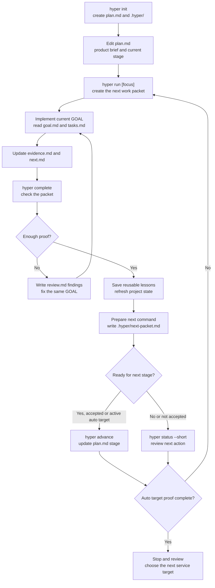

<p align="right">
  <a href="./README.md"><kbd>English</kbd></a>
  <a href="./README_ko.md"><kbd>한국어</kbd></a>
</p>

# Hyper Run

Hyper Run is a project rail for AI coding sessions.

It keeps Codex Desktop, CLI agents, and other coding assistants from restarting from zero every time. The plan, current task, proof, review notes, and next step live inside your repo, not only in chat.

You write `plan.md` once, then use one product command:

```bash
hyper run
```

If `plan.md` has a `Target Stage`, plain `hyper run` keeps moving packet by packet toward that target. It does not run unchecked. Each packet must leave evidence, pass `hyper complete`, and either continue, fix the same packet, advance stage after review, or stop.

The goal is simple: start from a tiny MVP and keep upgrading it until it can behave like a real service, without every AI session losing the project thread.

Current release: `v0.6.4`. It can continue packet by packet toward a target stage, stop and write review notes when evidence is weak, require approval before changing stages, compare Service Quality work against category references, verify release downloads, and recover stale stage state with `hyper migrate`.

## First Run

```bash
hyper init
# fill in plan.md once

hyper run
```

In Codex Desktop, use the same command as a project instruction:

```text
$hyper run
```

What happens:

1. `hyper run` reads `plan.md` and project history.
2. It creates `.hyper/goals/<GOAL-ID>/goal.md` and `tasks.md`.
3. The AI implements only that packet.
4. The AI records proof in `evidence.md` and the next recommendation in `next.md`.
5. `hyper complete` checks the packet.
6. `.hyper/next-packet.md` tells Codex whether to continue, fix the same packet, advance stage, or stop.

## Why It Helps

Long AI coding sessions often drift:

- the next task becomes too broad
- previous decisions are forgotten
- test or browser proof is scattered across chat
- a small MVP does not naturally grow into a reliable service

Hyper Run keeps the working context in files the next AI session can read.

It is not a project manager and not a big framework. It is a small CLI that creates the next focused AI work packet, asks for proof, and uses that proof to make the next packet sharper.

## The Short Loop

```text
plan.md -> hyper run -> goal.md/tasks.md -> evidence.md/next.md -> hyper complete -> next packet
```

What stays in your repo:

| File or command | What it means |
| --- | --- |
| `plan.md` | Product direction, current stage, target stage, constraints. |
| `hyper run` | Creates the next focused packet from the plan and prior evidence. |
| `goal.md` / `tasks.md` | What the AI should do now. |
| `evidence.md` | What changed and how it was checked. |
| `review.md` | What must be fixed if the packet is not good enough yet. |
| `next.md` | One next step and reusable lessons. |
| `hyper complete` | Checks the packet and prepares the next action. |
| `.hyper/next-packet.md` | The next allowed command and stop/continue guard. |
| `hyper status --short` | Shows the current stage, blocker, and next action. |

## How It Grows Without A Harness

Hyper Run does not ask you to build a harness on day one.

It starts light: one plan, one packet, one evidence file. If the same need keeps appearing, Hyper Run can suggest project-specific structure later, such as a validator, skill, agent, or harness.

For example:

- if every packet needs `npm run build`, Hyper Run may suggest a validator
- if every UI change needs a browser screenshot, it may suggest a visual check
- if the project repeatedly hits the same failure mode, it may turn that into a stop condition

Those suggestions are not forced immediately. They stay as candidates until repeated evidence proves they are useful.

## Internal Terms In Plain Words

You do not need these terms to start, but they explain what Hyper Run is doing:

| Term | Plain meaning |
| --- | --- |
| Runtime packet | The next AI work bundle. |
| Evidence | Proof that the work was done and checked. |
| Proof Contract | The packet's proof checklist. |
| Learn | Extracting reusable lessons from `evidence.md` and `next.md`. Not a summary. |
| Pressure Ledger | A list of repeated needs, gaps, or failures the project keeps showing. |
| Readiness pressure | The next missing proof needed to move the project forward. |
| Capability candidate | A suggested validator, skill, agent, or harness. It is not active yet. |
| Growth without a harness | Start light; add structure only after the project proves it needs it. |

The rules:

- no structure before repeated need
- no stage advancement without evidence
- no memory unless it changes future work

## Stages

Stages tell the AI what kind of proof matters right now.

| Stage | What Hyper Run tries to prove |
| --- | --- |
| Tiny MVP | One useful thing works. |
| Usable MVP | The main flow is usable end-to-end. |
| Beta | Realistic data, errors, validation, docs, and release path are repeatable. |
| Service Quality | Security, deployment, operations, rollback, repeatable checks, and category benchmark are good enough to treat it like a real service. |

For Service Quality benchmark examples, see [Reference Benchmark Evidence Examples](docs/examples/reference-benchmark.md).

`hyper run` keeps generating the next focused packet until the project reaches the stage you are aiming for.

## What Is Current

- `plan.md` can set `Target Stage`, so plain `hyper run` defaults to packet-by-packet continuation toward that target.
- When the target comes from `plan.md`, the planned continuation command stays plain `hyper run`; `--auto --until` is only needed for an explicit command-line override.
- If you used `--auto --until` and want to keep that override, follow the generated `--until` command; use plain `hyper run` to return to the `plan.md` target.
- While an explicit override is active, `hyper status` shows both the active override target and the `plan.md` target when they differ.
- If you change or remove `Target Stage`, the next status/run/migrate cycle follows the updated plan target.
- `hyper complete` runs a finish gate before learning from the packet. If evidence is weak, it writes `review.md` findings and keeps you in the same packet.
- If the same finish-gate findings repeat, Hyper Run records the repeat count and warns the agent to stop the auto loop unless the next fix directly addresses those findings.
- `hyper run --auto --until <stage>` still works as an explicit override. It still requires ready proof before stage advancement.
- `hyper advance` applies a stage change only after `hyper status` says the gate is ready. In an active auto target, `.hyper/next-packet.md` can carry that advancement after the Stage Advancement Review; outside auto mode, user acceptance is still required.
- Stage advancement output and `.hyper/next-packet.md` show the accepted gate, exact plan change, covered proof, continuation guard, and progress guard.
- If an auto target is active and the stage gate is already ready, another `hyper run` does not create a filler packet; it points back to the reviewed `hyper advance`.
- Beta and Service Quality packets require reference benchmark evidence unless it was already covered: the project must meet its category baseline and show one concrete strength.
- Installers and `hyper update` verify release checksums. If `cosign` is installed, signature verification also runs.
- `hyper doctor` checks install state, project state, SQLite, Codex routing, signature capability, and whether `.hyper/next-packet.md` matches current state and required handoff sections.
- `hyper status` and `hyper doctor` detect when `state.json` has an old stage that no longer matches `plan.md`; `hyper migrate` refreshes it.

## Basic Flow

```bash
hyper init
# edit plan.md once

hyper run
# implement the generated packet
# update evidence.md and next.md

hyper complete
hyper status --short
hyper advance   # when the stage gate is ready after review or an active auto target
hyper doctor
hyper run "Next improvement"
```

## Execution Flow



`hyper complete` checks the packet before saving lessons. If validation, stage evidence, active checks, or `next.md` is not good enough yet, it writes findings to the current packet's `review.md` and keeps you in the same packet. The same findings are also surfaced in `.hyper/next-packet.md` and `hyper resume` so the next Codex step fixes the current packet instead of starting new work.

For Service Quality and Sustained Service Quality packets, the evidence must also include a Self Review. Hyper Run expects the agent to judge plan alignment, core loop quality, product satisfaction, no drift, validation match, and an explicit `Verdict: pass`. A `fail` verdict keeps the same packet open for correction and carries the concrete quality gaps into `review.md`, `.hyper/next-packet.md`, and `hyper resume`.

Every packet also carries a no-drift guard. If the work would move outside `plan.md` product direction, target user, core loop, non-goals, or constraints, the agent should stop and record the blocker instead of widening the project silently.

For longer Codex Desktop sessions, put the target in `plan.md`:

```markdown
## Target Stage

Service Quality
```

Then plain `hyper run` uses that target, and `.hyper/next-packet.md` keeps the next command as `hyper run` so Codex Desktop can continue through the same product entrypoint. You can still override it from the command line:

```bash
hyper run --auto --until service-quality "Keep upgrading this service"
```

Use `Target Stage: Sustained Service Quality` or `--until sustained-service-quality` when the goal is to keep planning packets after Service Quality and focus on repeatable validators, operational handoff, and friction reduction.

`Current Stage` and `Target Stage` should use one of these stage names: `Tiny MVP`, `Usable MVP`, `Beta`, `Service Quality`, or `Sustained Service Quality`. If a stage value is unclear, Hyper Run stops and asks you to fix `plan.md` instead of guessing.

Auto mode does not skip proof. It keeps the next packet command planned in `.hyper/next-packet.md`; when a stage gate is ready, an active auto target can carry `hyper advance` after the Stage Advancement Review confirms ready proof and no blocking gaps. Outside auto mode, stage changes still require user acceptance with `hyper advance`.

`.hyper/next-packet.md` also tells Codex Desktop whether to continue with the next `run`, apply a reviewed `hyper advance`, fix the current packet's review/evidence/next notes, or stop because the target proof is complete, the packet is blocked, or user input is required. In auto mode it also includes a Progress Guard: continue only when the next command produces a new packet, stage change, changed readiness pressure, changed action/command, or corrected evidence. If the same command or finding repeats without progress, stop and report the loop risk.

After a blocked or waiting packet stops auto continuation, a plain `hyper run` using the plan target will not create another packet. Resolve the blocker, then start a deliberate follow-up with a clear focus such as `hyper run "Continue after API credentials are available"`.

The same planned action and guard are printed in the CLI output after packet completion or stage advancement, so the next command is visible without opening the file first.

`Target Stage` means Hyper Run keeps going until that stage's readiness proof is complete, not merely until `plan.md Current Stage` has that name. For example, `Target Stage: Service Quality` continues into Service Quality packets until validation, operations, benchmark, satisfaction, maintainability, and active-quality evidence are good enough for the Service Quality gate.

When the target proof is complete, plain `hyper run` stops by design. To keep going, raise `Target Stage`, remove it for manual packets, or run an explicit higher `--until` target.

In Codex Desktop you can use the same idea as a project command:

```text
$hyper init
$hyper run
```

`$hyper run` means Codex should run the native `hyper` CLI, read the generated `.hyper/goals/.../goal.md`, implement it, update evidence, and prepare the next recommendation.

## Install

### macOS / Linux

Install the latest native binary:

```bash
curl -fsSL https://raw.githubusercontent.com/KoreanCode/orange-hyper-run/main/install.sh | sh
```

For GitHub release installs, the installer downloads `checksums.txt` and verifies the binary with SHA256 before moving it into place.

Release assets also include cosign keyless signature bundles. If `cosign` is installed, the installer verifies the signature after checksum verification. To make signature verification mandatory, set `HYPER_RUN_VERIFY_SIGNATURE=required`.

Check it:

```bash
hyper version
```

Manual macOS install:

Apple Silicon:

```bash
mkdir -p ~/.local/bin
curl -fsSL https://github.com/KoreanCode/orange-hyper-run/releases/latest/download/hyper-darwin-arm64 -o ~/.local/bin/hyper
chmod +x ~/.local/bin/hyper
hyper version
```

Intel Mac:

```bash
mkdir -p ~/.local/bin
curl -fsSL https://github.com/KoreanCode/orange-hyper-run/releases/latest/download/hyper-darwin-amd64 -o ~/.local/bin/hyper
chmod +x ~/.local/bin/hyper
hyper version
```

### Windows

Install the latest Windows x64 binary with PowerShell:

```powershell
powershell -NoProfile -ExecutionPolicy Bypass -Command "irm https://raw.githubusercontent.com/KoreanCode/orange-hyper-run/main/install.ps1 | iex"
```

The PowerShell installer downloads `checksums.txt` and verifies the binary with SHA256 before moving it into place.

Release assets also include cosign keyless signature bundles. If `cosign` is installed, the installer verifies the signature after checksum verification. To make signature verification mandatory, set `$env:HYPER_RUN_VERIFY_SIGNATURE="required"`.

If the installer warns that `~\.local\bin` is not on `PATH`, add it:

```powershell
[Environment]::SetEnvironmentVariable("Path", $env:Path + ";$env:USERPROFILE\.local\bin", "User")
```

Open a new terminal, then check:

```powershell
hyper version
```

Other release binaries:

- `hyper-darwin-amd64` for Intel macOS
- `hyper-linux-amd64` for Linux x64
- `hyper-linux-arm64` for Linux ARM64
- `hyper-windows-amd64.exe` for Windows x64

Make sure `~/.local/bin` is on your `PATH`.

## Install From Source

```bash
go install github.com/KoreanCode/orange-hyper-run/cmd/hyper@latest
```

## Update

```bash
hyper update
```

This downloads the latest GitHub release. If Hyper Run cannot replace the current executable, it installs to `~/.local/bin/hyper`.
For GitHub release updates, Hyper Run downloads `checksums.txt` and verifies the binary before replacing the executable.

After updating an existing Hyper Run project, refresh the project state:

```bash
hyper version
hyper migrate
hyper doctor
hyper status --short
```

To update from a fork:

```bash
hyper update github:OWNER/orange-hyper-run
```

## After Updating A Project

Use this sequence when you update Hyper Run and then return to an existing project:

```bash
hyper update
hyper version
hyper migrate
hyper doctor
hyper status --short
```

What each step proves:

| Command | Why it matters |
| --- | --- |
| `hyper version` | Confirms which binary is active on your `PATH`. |
| `hyper migrate` | Refreshes older `.hyper/` state to the current growth and readiness rules. |
| `hyper doctor` | Checks install path, project files, SQLite, Codex routing, signature capability, and next-packet freshness. |
| `hyper status --short` | Shows the current stage, gate, proof, and next action without the full ledger. |

## Troubleshooting

If `hyper update` says it succeeded but `hyper version` still shows an older version:

```bash
which hyper
hyper version
```

Make sure the executable shown by `which hyper` is the same path printed by `hyper version`. If not, an older binary is earlier on your `PATH`.

If `hyper doctor` warns about stale project state:

```bash
hyper migrate
hyper doctor
```

If `hyper run` is blocked, finish the current packet first:

```bash
hyper resume
# update evidence.md and next.md
hyper complete
```

If `hyper complete` writes `review.md`, fix that same packet instead of starting a new `hyper run`.

## Project Setup

Run this once inside your project:

```bash
hyper init
```

It creates:

- `plan.md`
- `.hyper/`
- Codex Desktop routing files such as `AGENTS.md` and `.agents/skills/...`

Then fill in `plan.md` in plain language:

```markdown
# Product Plan

## Product

What are we building?

## Target Users

Who is it for?

## MVP

What is the smallest useful version?

## Current Stage

Tiny MVP

## Target Stage

Service Quality

## Build Style

Web app

## Non-goals

What should not be built yet?

## Constraints

Technical or product constraints.

## Success Criteria

How do we know this stage is done?

## Current Focus

What should the next run improve?
```

Short form also works:

```markdown
# Plan

Project: Service Desk Lite
Current Stage: Tiny MVP
Run Until: Service Quality
Build Style: Thin vertical slice first.

Product brief:
A teammate can create one support request, see it in a list, and mark it handled.

Validation:
One smoke command proves the create/list/handle flow.
```

If `plan.md` is sparse, Hyper Run may create `.hyper/plan-candidates.md` from README or docs so you can copy useful product context into `plan.md`.

## What `hyper run` Does

`hyper run` creates a new runtime packet:

```text
.hyper/goals/GOAL-0001/
  goal.md
  tasks.md
  evidence.md
  review.md
  next.md
```

The important files are:

- `goal.md`: what to build now
- `tasks.md`: checkpoints for this run
- `evidence.md`: proof of what changed and what was validated
- `next.md`: what should happen next

Hyper Run blocks a new `hyper run` if the previous packet still has pending evidence. Finish the current packet with `hyper complete` first.

## What `hyper complete` Does

After implementation, update `evidence.md` and `next.md`, then run:

```bash
hyper complete
```

This closes the current packet and updates project memory:

- decisions to keep
- reusable patterns
- failures or blockers
- constraints
- readiness progress

`hyper complete` also prints the next recommended action. If the gate is ready, it will tell you to run `hyper advance`. Otherwise it will point to the next smallest `hyper run` focus. The next `hyper run` uses the learned information to change the work boundary, validation signals, stop conditions, readiness pressure, capability candidates, and capability activation policy.

## Readiness In Simple Terms

Hyper Run tries to grow the project stage by stage:

```text
Tiny MVP -> Usable MVP -> Beta -> Service Quality
```

It checks whether the project has evidence for things like:

- product clarity
- core UX
- persistence
- error handling
- validation
- security
- deployment
- docs
- maintainability
- product satisfaction

You record this in `evidence.md`:

```text
## Readiness Evidence

Core UX: Browser smoke test passed for create and complete flow.
Validation coverage: `go test ./...` passed and is repeatable.
Data persistence: Records survive reload using SQLite.
Product satisfaction: Target-user fit, copy quality, coherent core loop, and no drift were accepted; verdict pass.
```

When enough evidence exists, `hyper status` shows the next stage is ready. Hyper Run still does not change the stage from inside a work packet. If you accept the recommendation, or if an active auto target already asked Hyper Run to continue after the Stage Advancement Review, run:

```bash
hyper advance
```

That updates `plan.md` from the current stage to the next stage, refreshes readiness, and then the next planned command starts using the new stage behavior.

## Commands

```bash
hyper init                  # install Hyper Run files in this project
hyper run [focus]           # create the next packet; uses plan.md Target Stage when present
hyper run --auto --until service-quality [focus]  # explicit target override
hyper run --auto --until sustained-service-quality [focus]
hyper complete              # run the finish gate, close the packet, and learn
hyper advance               # apply a ready stage change after review or active auto target
hyper status                # show current stage, gaps, and readiness
hyper status --short        # show only stage, gate, proof, and next action
hyper doctor                # diagnose install, PATH, project state, and Codex routing
hyper repair                # reconcile state.json when packet evidence and state disagree
hyper migrate               # refresh growth/readiness state after Hyper Run upgrades
hyper resume                # print the current handoff again
hyper update                # update the native binary
hyper version               # show version and binary path
hyper internal learn        # debug/manual learning command
```

## Local Development

From this repository:

Use the latest Go patch release available for this project. CI and releases currently use Go `1.26.4` so `govulncheck` runs against the patched standard library.

```bash
go test -count=1 ./...
go vet ./...
staticcheck ./...
govulncheck ./...
go build -o dist/hyper ./cmd/hyper
```

Then test it in another project:

```bash
cd ../my-project
../orange-hyper-run/dist/hyper init
../orange-hyper-run/dist/hyper run "Build the smallest usable MVP"
../orange-hyper-run/dist/hyper complete
```

## More Detail

- [Service Definition](docs/SERVICE_DEFINITION.md)
- [Architecture](docs/ARCHITECTURE.md)
- [Tiny MVP Flow Example](examples/tiny-mvp-flow/README.md)
- [Before / After Demo](examples/before-after-demo/README.md)
- [Reference Benchmark Examples](docs/examples/reference-benchmark.md)
- [Release Checklist](docs/RELEASE_CHECKLIST.md)
- [Roadmap](docs/ROADMAP.md)
- [Changelog](docs/CHANGELOG.md)
- [Known Limitations](docs/KNOWN_LIMITATIONS.md)

## License

MIT License. See [LICENSE](LICENSE).
