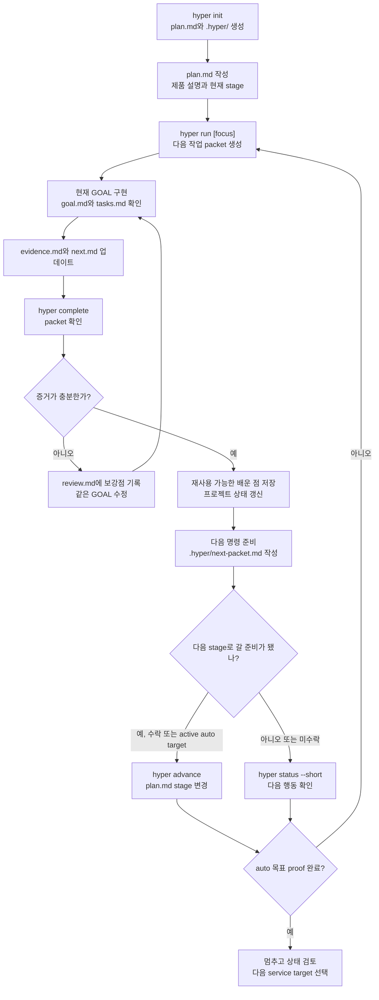

<p align="right">
  <a href="./README.md"><kbd>English</kbd></a>
  <a href="./README_ko.md"><kbd>한국어</kbd></a>
</p>

# Hyper Run

Hyper Run은 AI 코딩 세션이 리셋되지 않게 하는 프로젝트 진행 레일입니다.

Codex Desktop, CLI 에이전트, 다른 코딩 assistant가 매번 처음부터 다시 시작하지 않도록 합니다. 계획, 현재 작업, 검증 증거, review, 다음 행동이 채팅이 아니라 repo 안에 남습니다.

`plan.md`를 한 번 적고, 제품 명령은 하나만 씁니다.

```bash
hyper run
```

`plan.md`에 `Target Stage`가 있으면 plain `hyper run`이 그 목표까지 packet 단위로 계속 이어갑니다. 단, 무검토 자동 실행은 아닙니다. 각 packet은 evidence를 남기고, `hyper complete`를 통과해야 하며, 다음 packet으로 갈지, 같은 packet을 고칠지, stage를 올릴지, 멈출지 결정합니다.

목표는 단순합니다. 작은 MVP에서 시작해, AI 세션이 바뀌어도 문맥을 잃지 않고 실제 서비스처럼 다룰 수 있는 수준까지 계속 개선하는 것입니다.

현재 릴리즈는 `v0.6.3`입니다. 목표 stage까지 packet 단위로 이어가고, evidence가 약하면 멈춰서 review를 남기며, stage 변경은 사용자가 승인할 때만 적용합니다. Service Quality에서는 비슷한 reference와 비교할 수 있고, 설치/업데이트를 검증하며, 오래된 stage 상태는 `hyper migrate`로 복구합니다.

## 첫 실행

```bash
hyper init
# plan.md를 한 번 채웁니다

hyper run
```

Codex Desktop에서는 프로젝트 명령처럼 이렇게 씁니다.

```text
$hyper run
```

흐름은 이렇습니다.

1. `hyper run`이 `plan.md`와 이전 기록을 읽습니다.
2. `.hyper/goals/<GOAL-ID>/goal.md`와 `tasks.md`를 만듭니다.
3. AI는 그 packet 하나만 구현합니다.
4. `evidence.md`에 검증 증거를 남기고 `next.md`에 다음 추천 작업을 씁니다.
5. `hyper complete`가 packet을 확인합니다.
6. `.hyper/next-packet.md`가 계속할지, 같은 packet을 고칠지, stage를 올릴지, 멈출지 알려줍니다.

## 왜 도움이 되나요

AI 코딩을 오래 이어가면 이런 문제가 생깁니다.

- 다음 작업이 너무 넓어짐
- 이전 결정이 잊힘
- 테스트나 브라우저 확인 기록이 채팅 안에 흩어짐
- 작은 MVP가 안정적인 서비스로 자연스럽게 이어지지 않음

Hyper Run은 다음 AI 세션이 읽을 수 있도록 이 문맥을 파일로 남깁니다.

복잡한 프로젝트 관리 도구가 아닙니다. 큰 프레임워크도 아닙니다. 다음 AI 작업 packet을 만들고, 검증 증거를 요구하고, 그 증거를 바탕으로 다음 packet을 더 정확하게 만드는 작은 CLI입니다.

## 짧은 루프

```text
plan.md -> hyper run -> goal.md/tasks.md -> evidence.md/next.md -> hyper complete -> 다음 packet
```

repo 안에 남는 것은 이 정도입니다.

| 파일 또는 명령 | 의미 |
| --- | --- |
| `plan.md` | 제품 방향, 현재 stage, 목표 stage, 제약을 적는 파일입니다. |
| `hyper run` | 계획과 이전 evidence를 읽고 다음 packet을 만듭니다. |
| `goal.md` / `tasks.md` | AI가 지금 해야 할 작업입니다. |
| `evidence.md` | 무엇을 바꿨고 어떻게 확인했는지 남기는 파일입니다. |
| `review.md` | packet이 아직 부족하면 고칠 내용을 남기는 파일입니다. |
| `next.md` | 다음 작업 하나와 재사용 가능한 배운 점을 남기는 파일입니다. |
| `hyper complete` | packet을 확인하고 다음 행동을 준비합니다. |
| `.hyper/next-packet.md` | 다음에 허용된 명령과 계속/중단 조건입니다. |
| `hyper status --short` | 현재 단계, 막힌 이유, 다음 행동을 짧게 보여줍니다. |

## 하네스 없이 어떻게 성장하나요

Hyper Run은 첫날부터 하네스를 만들라고 하지 않습니다.

가볍게 시작합니다. 하나의 plan, 하나의 작업 packet, 하나의 evidence 파일입니다. 같은 필요가 계속 반복되면 그때 validator, skill, agent, harness 같은 프로젝트 전용 구조를 후보로 제안합니다.

예를 들어:

- 매번 `npm run build`가 필요하면 validator 후보를 제안할 수 있습니다.
- UI 변경마다 브라우저 screenshot이 필요하면 visual check 후보를 제안할 수 있습니다.
- 같은 실패가 반복되면 그 실패를 stop condition으로 만들 수 있습니다.

이 제안들은 바로 강제되지 않습니다. 반복 evidence가 충분할 때까지 candidate로 남습니다.

## 내부 용어를 쉽게 보면

시작할 때 외울 필요는 없습니다. 다만 Hyper Run이 하는 일을 설명하면 이렇습니다.

| 용어 | 쉽게 말하면 |
| --- | --- |
| Runtime packet | 다음 AI 작업 묶음입니다. |
| Evidence | 작업이 됐고 확인했다는 증거입니다. |
| Proof Contract | 이번 packet의 증명 체크리스트입니다. |
| Learn | `evidence.md`와 `next.md`에서 다음 작업에 다시 쓸 신호만 뽑는 단계입니다. 단순 요약이 아닙니다. |
| Pressure Ledger | 프로젝트가 반복해서 보여준 필요, gap, 실패를 모아둔 목록입니다. |
| Readiness pressure | 다음 단계로 가기 위해 지금 가장 부족한 증거입니다. |
| Capability candidate | validator, skill, agent, harness 제안입니다. 아직 활성화된 것은 아닙니다. |
| 하네스 없이 성장 | 가볍게 시작하고, 필요가 증명될 때만 구조를 추가하는 방식입니다. |

규칙은 이렇습니다.

- 반복 필요가 있기 전에는 구조를 만들지 않습니다.
- evidence 없이 stage를 올리지 않습니다.
- 다음 작업을 바꾸지 않는 기록은 memory로 남기지 않습니다.

## Stage

Stage는 지금 어떤 증거가 중요한지 알려줍니다.

| Stage | Hyper Run이 증명하려는 것 |
| --- | --- |
| Tiny MVP | 유용한 동작 하나가 실제로 되는지. |
| Usable MVP | 주요 flow를 처음부터 끝까지 사용할 수 있는지. |
| Beta | 현실적인 데이터, 실패 처리, 검증, 문서, release path가 반복 가능한지. |
| Service Quality | 보안, 배포, 운영, rollback, 반복 검증, category benchmark가 실제 서비스처럼 다룰 만큼 충분한지. |

Service Quality benchmark 예시는 [Reference Benchmark Evidence 예시](docs/examples/reference-benchmark_ko.md)를 참고하세요.

`hyper run`은 목표 stage에 가까워질 때까지 다음 집중 작업 packet을 계속 만듭니다.

## 현재 기능

- `plan.md`에 `Target Stage`를 적으면 plain `hyper run`이 그 목표까지 packet 단위 continuation으로 동작합니다.
- 목표가 `plan.md`에서 왔을 때 다음 continuation 명령도 plain `hyper run`으로 유지합니다. `--auto --until`은 명령어에서 직접 목표를 override할 때만 씁니다.
- `--auto --until` override를 계속 쓰려면 생성된 `--until` 명령을 따르고, `plan.md` 목표로 돌아가려면 plain `hyper run`을 쓰면 됩니다.
- 명시 override가 켜져 있고 `plan.md` 목표와 다르면 `hyper status`가 현재 override 목표와 `plan.md` 목표를 같이 보여줍니다.
- `Target Stage`를 바꾸거나 제거하면 다음 status/run/migrate 흐름이 수정된 plan target을 따릅니다.
- `hyper complete`는 packet을 학습하기 전에 finish gate를 실행합니다. evidence가 약하면 `review.md`에 보강할 내용을 남기고 같은 packet에 머무릅니다.
- 같은 finish-gate finding이 반복되면 반복 횟수를 기록하고, 다음 수정이 그 finding을 직접 해결하지 않는 한 auto loop를 멈추도록 경고합니다.
- `hyper run --auto --until <stage>`는 명시적인 override로 계속 사용할 수 있습니다. stage advancement 전에는 여전히 ready proof가 필요합니다.
- `hyper advance`는 `hyper status`가 gate ready라고 말할 때만 적용합니다. active auto target 안에서는 `.hyper/next-packet.md`가 Stage Advancement Review 뒤의 advancement를 이어갈 수 있고, auto mode 밖에서는 사용자 승인이 필요합니다.
- Stage advancement 출력과 `.hyper/next-packet.md`는 accepted gate, 정확한 plan change, 충족된 proof, continuation guard, progress guard를 보여줍니다.
- auto target이 켜져 있고 stage gate가 이미 ready이면 다시 `hyper run`을 실행해도 filler packet을 만들지 않고, 검토된 `hyper advance`로 안내합니다.
- Beta와 Service Quality packet에서는 이미 충족된 경우가 아니면 reference benchmark evidence가 필요합니다. 해당 category의 기본 기대치를 충족하고, 구체적인 강점 하나가 있어야 합니다.
- installer와 `hyper update`는 release checksum을 검증합니다. `cosign`이 설치되어 있으면 signature 검증도 실행합니다.
- `hyper doctor`는 설치 상태, 프로젝트 상태, SQLite, Codex routing, signature 검증 가능 여부, `.hyper/next-packet.md`의 최신성과 필요한 handoff section을 확인합니다.
- `hyper status`와 `hyper doctor`는 `state.json`의 오래된 stage가 `plan.md`와 다르면 알려줍니다. `hyper migrate`가 그 상태를 갱신합니다.

## 기본 흐름

```bash
hyper init
# plan.md를 한 번 채웁니다

hyper run
# 생성된 packet을 구현합니다
# evidence.md와 next.md를 업데이트합니다

hyper complete
hyper status --short
hyper advance   # stage gate가 ready이고 review 또는 active auto target 뒤 실행합니다
hyper doctor
hyper run "다음 개선 작업"
```

## 실행 흐름



`hyper complete`는 배운 점을 저장하기 전에 packet을 먼저 확인합니다. validation, stage evidence, active check, `next.md`가 부족하면 현재 packet의 `review.md`에 보강할 내용을 남기고 같은 packet에 머무르게 합니다. 같은 finding은 `.hyper/next-packet.md`와 `hyper resume`에도 표시되어, 다음 Codex 단계가 새 작업을 시작하지 않고 현재 packet을 보강하게 합니다.

Service Quality와 Sustained Service Quality packet에서는 Self Review도 필요합니다. Hyper Run은 agent가 plan alignment, core loop quality, product satisfaction, no drift, validation match를 직접 판단하고 `Verdict: pass`를 남기길 요구합니다. `fail`이면 같은 packet을 열어둔 채 재작업하게 하고, 구체적인 품질 gap을 `review.md`, `.hyper/next-packet.md`, `hyper resume`에 전달합니다.

모든 packet에는 no-drift guard도 들어갑니다. 작업이 `plan.md`의 제품 방향, 대상 사용자, 핵심 loop, non-goal, constraint를 벗어나야 한다면 agent는 조용히 범위를 넓히지 않고 멈춰서 blocker로 기록해야 합니다.

Codex Desktop에서 더 긴 세션을 돌릴 때는 목표 stage를 `plan.md`에 적습니다.

```markdown
## Target Stage

Service Quality
```

그러면 plain `hyper run`이 그 목표를 사용하고, `.hyper/next-packet.md`의 다음 명령도 `hyper run`으로 유지됩니다. Codex Desktop이 같은 제품 entrypoint로 이어갈 수 있게 하기 위해서입니다. 명령어에서 직접 override할 수도 있습니다.

```bash
hyper run --auto --until service-quality "서비스 수준까지 계속 고도화"
```

Service Quality 이후에도 품질을 유지하는 방향이면 `Target Stage: Sustained Service Quality` 또는 `--until sustained-service-quality`를 사용합니다.

`Current Stage`와 `Target Stage`에는 `Tiny MVP`, `Usable MVP`, `Beta`, `Service Quality`, `Sustained Service Quality` 중 하나를 사용하세요. stage 값이 애매하면 Hyper Run은 추측하지 않고 `plan.md`를 고치라고 멈춥니다.

auto mode는 proof를 건너뛰지 않습니다. 다음 packet 명령은 `.hyper/next-packet.md`에 계획하고, stage gate가 ready이면 active auto target이 Stage Advancement Review의 ready proof와 blocking gap 없음 확인 뒤 `hyper advance`를 이어갈 수 있습니다. auto mode 밖에서는 stage 변경에 여전히 사용자 승인이 필요합니다.

`.hyper/next-packet.md`는 Codex Desktop이 다음 `run`을 이어갈지, 검토된 `hyper advance`를 적용할지, 현재 packet의 review/evidence/next notes를 보강할지, target proof 완료, blocked 상태, 사용자 입력 필요 때문에 멈출지도 함께 알려줍니다. Auto mode에서는 Progress Guard도 포함합니다. 다음 명령이 새 packet, stage 변경, readiness pressure 변경, action/command 변경, 또는 보강된 evidence를 만들 때만 계속하고, 같은 명령이나 같은 finding이 진전 없이 반복되면 멈춰서 loop risk를 보고합니다.

blocked 또는 waiting packet 때문에 auto continuation이 멈춘 뒤에는 plan target을 쓰는 plain `hyper run`이 새 packet을 만들지 않습니다. blocker를 해결한 뒤 `hyper run "API credential 준비 후 계속"`처럼 명확한 focus를 넣어 의도적인 follow-up을 시작하세요.

packet 완료나 stage advancement 이후 CLI 출력에도 같은 planned action과 guard를 보여줍니다. 파일을 먼저 열지 않아도 다음에 해도 되는 명령과 멈춰야 할 조건을 바로 볼 수 있습니다.

`Target Stage`는 `plan.md Current Stage` 이름이 그 단계가 되는 순간을 뜻하지 않습니다. 그 단계의 readiness proof가 완료될 때까지 계속한다는 뜻입니다. 예를 들어 `Target Stage: Service Quality`는 Service Quality packet 안에서도 validation, operations, benchmark, satisfaction, maintainability, active-quality evidence가 충분해질 때까지 계속 진행합니다.

target proof가 완료되면 plain `hyper run`은 의도적으로 멈춥니다. 계속 진행하려면 `Target Stage`를 더 높이거나, manual packet을 위해 제거하거나, 더 높은 `--until` target을 명시하세요.

Codex Desktop에서는 프로젝트 명령처럼 사용할 수 있습니다.

```text
$hyper init
$hyper run
```

`$hyper run`은 Codex가 native `hyper` CLI를 실행하고, 생성된 `.hyper/goals/.../goal.md`를 읽고, 구현한 뒤, evidence와 다음 추천 작업까지 남긴다는 뜻입니다.

## 설치

### macOS / Linux

최신 native binary를 설치합니다.

```bash
curl -fsSL https://raw.githubusercontent.com/KoreanCode/orange-hyper-run/main/install.sh | sh
```

GitHub release에서 설치할 때 installer는 `checksums.txt`를 함께 내려받고, binary를 옮기기 전에 SHA256 checksum을 검증합니다.

Release asset에는 cosign keyless signature bundle도 포함됩니다. `cosign`이 설치되어 있으면 installer가 checksum 검증 후 signature도 검증합니다. signature 검증을 필수로 만들려면 `HYPER_RUN_VERIFY_SIGNATURE=required`를 설정합니다.

설치 확인:

```bash
hyper version
```

macOS 수동 설치:

Apple Silicon:

```bash
mkdir -p ~/.local/bin
curl -fsSL https://github.com/KoreanCode/orange-hyper-run/releases/latest/download/hyper-darwin-arm64 -o ~/.local/bin/hyper
chmod +x ~/.local/bin/hyper
hyper version
```

Intel Mac:

```bash
mkdir -p ~/.local/bin
curl -fsSL https://github.com/KoreanCode/orange-hyper-run/releases/latest/download/hyper-darwin-amd64 -o ~/.local/bin/hyper
chmod +x ~/.local/bin/hyper
hyper version
```

### Windows

PowerShell에서 최신 Windows x64 binary를 설치합니다.

```powershell
powershell -NoProfile -ExecutionPolicy Bypass -Command "irm https://raw.githubusercontent.com/KoreanCode/orange-hyper-run/main/install.ps1 | iex"
```

PowerShell installer는 `checksums.txt`를 함께 내려받고, binary를 옮기기 전에 SHA256 checksum을 검증합니다.

Release asset에는 cosign keyless signature bundle도 포함됩니다. `cosign`이 설치되어 있으면 installer가 checksum 검증 후 signature도 검증합니다. signature 검증을 필수로 만들려면 `$env:HYPER_RUN_VERIFY_SIGNATURE="required"`를 설정합니다.

installer가 `~\.local\bin`이 `PATH`에 없다고 경고하면 추가합니다.

```powershell
[Environment]::SetEnvironmentVariable("Path", $env:Path + ";$env:USERPROFILE\.local\bin", "User")
```

새 터미널을 열고 확인합니다.

```powershell
hyper version
```

다른 release binary:

- `hyper-darwin-amd64`: Intel macOS
- `hyper-linux-amd64`: Linux x64
- `hyper-linux-arm64`: Linux ARM64
- `hyper-windows-amd64.exe`: Windows x64

`~/.local/bin`이 `PATH`에 들어 있어야 합니다.

## Source에서 설치

```bash
go install github.com/KoreanCode/orange-hyper-run/cmd/hyper@latest
```

## 업데이트

```bash
hyper update
```

최신 GitHub release를 내려받습니다. 현재 실행 파일을 교체할 수 없으면 `~/.local/bin/hyper`에 설치합니다.
GitHub release에서 업데이트할 때 Hyper Run은 `checksums.txt`를 내려받고 binary를 검증한 뒤 실행 파일을 교체합니다.

기존 Hyper Run 프로젝트에서 CLI를 업데이트했다면 프로젝트 상태도 갱신합니다.

```bash
hyper version
hyper migrate
hyper doctor
hyper status --short
```

fork에서 업데이트하려면:

```bash
hyper update github:OWNER/orange-hyper-run
```

## 프로젝트 업데이트 후 확인 흐름

Hyper Run을 업데이트한 뒤 기존 프로젝트로 돌아왔을 때는 이 순서로 확인합니다.

```bash
hyper update
hyper version
hyper migrate
hyper doctor
hyper status --short
```

각 단계의 의미:

| 명령 | 확인하는 것 |
| --- | --- |
| `hyper version` | 현재 `PATH`에서 실행되는 binary 버전을 확인합니다. |
| `hyper migrate` | 오래된 `.hyper/` 상태를 현재 growth/readiness 규칙에 맞게 갱신합니다. |
| `hyper doctor` | 설치 경로, 프로젝트 파일, SQLite, Codex routing, signature 검증 가능 여부, next-packet 최신성을 확인합니다. |
| `hyper status --short` | 전체 ledger 없이 현재 stage, gate, proof, 다음 행동만 확인합니다. |

## 문제 해결

`hyper update`는 성공했다고 나오는데 `hyper version`이 예전 버전이면:

```bash
which hyper
hyper version
```

`which hyper`가 보여주는 실행 파일과 `hyper version`이 출력하는 경로가 같은지 확인합니다. 다르면 예전 binary가 `PATH`에서 더 앞에 있는 것입니다.

`hyper doctor`가 project state가 오래됐다고 경고하면:

```bash
hyper migrate
hyper doctor
```

`hyper run`이 막히면 현재 packet을 먼저 닫습니다.

```bash
hyper resume
# evidence.md와 next.md를 업데이트합니다
hyper complete
```

`hyper complete`가 `review.md`를 작성했다면 새 `hyper run`을 시작하지 말고 같은 packet을 보강합니다.

## 프로젝트 설정

대상 프로젝트 안에서 한 번 실행합니다.

```bash
hyper init
```

생성되는 것:

- `plan.md`
- `.hyper/`
- Codex Desktop 라우팅 파일인 `AGENTS.md`, `.agents/skills/...`

그다음 `plan.md`를 평범한 문장으로 채웁니다.

```markdown
# Product Plan

## Product

무엇을 만들고 있나요?

## Target Users

누구를 위한 제품인가요?

## MVP

가장 작은 유용한 버전은 무엇인가요?

## Current Stage

Tiny MVP

## Target Stage

Service Quality

## Build Style

Web app

## Non-goals

아직 만들지 않을 것은 무엇인가요?

## Constraints

기술 또는 제품 제약은 무엇인가요?

## Success Criteria

이번 단계가 끝났다는 기준은 무엇인가요?

## Current Focus

다음 run에서 무엇을 개선해야 하나요?
```

짧게 써도 됩니다.

```markdown
# Plan

Project: Service Desk Lite
Current Stage: Tiny MVP
Run Until: Service Quality
Build Style: Thin vertical slice first.

Product brief:
팀원이 지원 요청 하나를 만들고, 목록에서 보고, 처리 완료로 바꿀 수 있습니다.

Validation:
하나의 smoke command로 create/list/handle flow를 증명합니다.
```

`plan.md`가 너무 비어 있으면 Hyper Run이 README나 docs를 읽고 `.hyper/plan-candidates.md`를 만들 수 있습니다. 거기서 쓸 만한 제품 문맥을 `plan.md`로 옮기면 됩니다.

## `hyper run`이 하는 일

`hyper run`은 새 runtime packet을 만듭니다.

```text
.hyper/goals/GOAL-0001/
  goal.md
  tasks.md
  evidence.md
  review.md
  next.md
```

중요한 파일은 다음입니다.

- `goal.md`: 지금 만들 작업
- `tasks.md`: 이번 run의 체크포인트
- `evidence.md`: 무엇을 바꿨고 어떻게 검증했는지
- `next.md`: 다음에 무엇을 해야 하는지

이전 packet의 evidence가 아직 pending이면 새 `hyper run`은 막힙니다. 먼저 `hyper complete`로 현재 packet을 닫아야 합니다.

## `hyper complete`가 하는 일

구현이 끝나면 `evidence.md`와 `next.md`를 업데이트한 뒤 실행합니다.

```bash
hyper complete
```

이 명령은 현재 packet을 닫고 프로젝트 memory를 업데이트합니다.

- 유지해야 할 결정
- 재사용할 패턴
- 실패나 blocker
- 지켜야 할 제약
- readiness 진행 상태

다음 `hyper run`은 이 정보를 사용합니다.
구체적으로 다음 work boundary, validation signal, stop condition, readiness pressure, capability candidate, capability activation policy에 영향을 줍니다.

## Readiness를 쉽게 말하면

Hyper Run은 프로젝트가 단계별로 커지도록 돕습니다.

```text
Tiny MVP -> Usable MVP -> Beta -> Service Quality
```

다음 항목에 대한 evidence가 있는지 봅니다.

- 제품 정의
- 핵심 UX
- 데이터 저장
- 에러 처리
- 검증
- 보안
- 배포
- 문서
- 유지보수성
- 제품 만족도

이 내용은 `evidence.md`에 이렇게 적습니다.

```text
## Readiness Evidence

Core UX: 브라우저 smoke test에서 생성과 완료 flow가 통과했다.
Validation coverage: `go test ./...`가 통과했고 반복 실행 가능하다.
Data persistence: SQLite로 저장한 records가 reload 뒤에도 유지된다.
Product satisfaction: 대상 사용자 적합성, copy quality, coherent core loop, no drift가 확인되었고 verdict pass.
```

evidence가 충분하면 `hyper status`에서 다음 stage로 올릴 준비가 됐는지 보여줍니다. Hyper Run은 작업 packet 안에서 stage를 조용히 바꾸지는 않습니다. 사용자가 stage 변경을 받아들이거나, active auto target이 Stage Advancement Review 뒤 계속 진행하도록 이미 지정되어 있을 때 실행합니다.

```bash
hyper advance
```

이 명령은 `plan.md`의 현재 stage를 다음 stage로 바꾸고 readiness를 갱신합니다. 그 다음 계획된 명령은 새 stage 기준으로 동작합니다.

## 명령어

```bash
hyper init                  # 프로젝트에 Hyper Run 파일 설치
hyper run [focus]           # 다음 packet 생성; plan.md Target Stage가 있으면 그 목표를 사용
hyper run --auto --until service-quality [focus]  # 명시적인 목표 override
hyper run --auto --until sustained-service-quality [focus]
hyper complete              # finish gate를 통과한 뒤 packet을 닫고 학습
hyper advance               # ready stage 변경을 review 또는 active auto target 뒤 적용
hyper status                # 현재 stage, gap, readiness 확인
hyper status --short        # stage, gate, proof, 다음 행동만 짧게 확인
hyper doctor                # 설치, PATH, 프로젝트 상태, Codex 라우팅 진단
hyper repair                # packet evidence와 state.json이 어긋날 때 상태 복구
hyper migrate               # Hyper Run 업그레이드 뒤 growth/readiness 상태 갱신
hyper resume                # 현재 handoff 다시 출력
hyper update                # native binary 업데이트
hyper version               # 버전과 binary 경로 확인
hyper internal learn        # 디버그/수동 학습 명령
```

## 로컬 개발

이 repository에서:

이 프로젝트에서 사용할 수 있는 최신 Go patch release를 사용하세요. 현재 CI와 release는 Go `1.26.4`를 사용해 `govulncheck`가 패치된 standard library 기준으로 실행되게 합니다.

```bash
go test -count=1 ./...
go vet ./...
staticcheck ./...
govulncheck ./...
go build -o dist/hyper ./cmd/hyper
```

다른 프로젝트에서 테스트합니다.

```bash
cd ../my-project
../orange-hyper-run/dist/hyper init
../orange-hyper-run/dist/hyper run "가장 작은 사용 가능한 MVP를 만들어줘"
../orange-hyper-run/dist/hyper complete
```

## 더 자세한 문서

- [서비스 정의](docs/SERVICE_DEFINITION_ko.md)
- [아키텍처](docs/ARCHITECTURE_ko.md)
- [Tiny MVP Flow 예제](examples/tiny-mvp-flow/README_ko.md)
- [Before / After 데모](examples/before-after-demo/README_ko.md)
- [Reference Benchmark 예시](docs/examples/reference-benchmark_ko.md)
- [릴리즈 체크리스트](docs/RELEASE_CHECKLIST_ko.md)
- [로드맵](docs/ROADMAP_ko.md)
- [변경 기록](docs/CHANGELOG_ko.md)
- [알려진 한계](docs/KNOWN_LIMITATIONS_ko.md)

## 라이선스

MIT License입니다. 자세한 내용은 [LICENSE](LICENSE)를 참고하세요.
